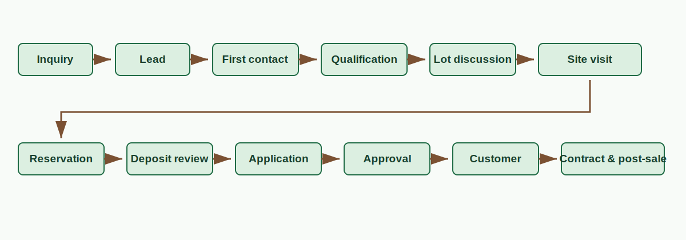

# Sales and buyer journey overview

The buyer journey is a recommended operating sequence, not an automatic workflow. Staff must verify records, assign ownership, and document the next action at each stage.

| Stage | Owner | Required information | Expected status / next step |
| --- | --- | --- | --- |
| Inquiry to lead | Sales coordinator | Contact, source, interest, duplicate check | `new_lead`; first contact task |
| Qualification | Assigned sales staff | Need, lot interest, plan/budget, contact method | `contacted` or `interested`; visit/next action |
| Site visit | Sales staff | Date, location, owner, outcome | Visit status; follow-up or reservation |
| Reservation | Authorized staff | Lot, expiry, deposit expectation, assignee | Reservation readiness; financial review separate |
| Application | Admin/authorized reviewer | Applicant, lot, acknowledgements, conflicts | `Pending Review` → decision |
| Customer/contract | Admin/operations | Approved application, terms, document status | Customer/contract and post-sales work |

**Media:** Workflow diagram, fictional scenario, checklist.
